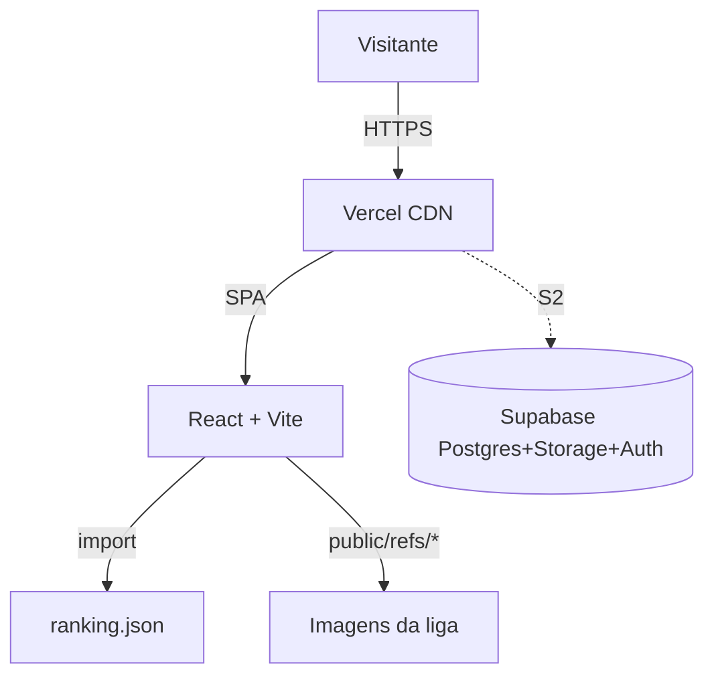

---
tags:
  - projeto/premodern-bh
  - sprint/S1
  - tech/react
  - tech/typescript
  - tech/vite
  - tech/tailwind
  - tech/supabase
  - tema/old-frame
date: 2026-04-14
---

# Liga Premodern Beagá — Sprint S1

## Objetivo da Sprint
Entregar o **scaffold do site** da liga em React+TS com **landing page institucional** e **aba de Ranking** consumindo mockup JSON, com identidade visual fiel ao **old frame** do Magic: The Gathering. Repositório público no GitHub, pronto para deploy na Vercel.

## Cards Concluídos

| Tag | Título | Área | Status |
|-----|--------|------|--------|
| `[14ABR S1F1]` | Scaffold React+TS+Vite+Tailwind+Router | Front | ✅ Concluído |
| `[14ABR S1F2]` | Layout base (Header sticky, Footer 3 colunas, tema old-frame) | Front | ✅ Concluído |
| `[14ABR S1F3]` | Landing — Hero + Sobre Premodern + Sobre a Liga | Front | ✅ Concluído |
| `[14ABR S1F4]` | Landing — Como Participar + Galeria + Próximos Eventos | Front | ✅ Concluído |
| `[14ABR S1F5]` | Página `/ranking` com Top 8 banner + tabela completa | Front | ✅ Concluído |
| `[14ABR S1B1]` | Mockup JSON com 24 jogadores reais da temporada | Back | ✅ Concluído |
| `[14ABR S1G1]` | Commit inicial + criação do repositório público | Git | ✅ Concluído |

## Stack Definida

| Camada | Tecnologia | Versão |
|---|---|---|
| Bundler | Vite | 5.3 |
| Framework | React | 18.3 + TypeScript 5.5 |
| Roteamento | React Router | 6.26 |
| Estilização | Tailwind CSS | 3.4 |
| Ícones | lucide-react | 0.395 |
| Tipografia | Cinzel + EB Garamond | Google Fonts |
| Deploy (S1I1) | Vercel | a configurar |
| BaaS (S2) | Supabase | a integrar |

## Decisões Técnicas

### 1. Stack React + Vite (em vez de Next.js)
- **Contexto:** Site essencialmente estático com 1 página dinâmica (ranking) que vai consumir Supabase no S2.
- **Decisão:** SPA com Vite + React Router.
- **Alternativas consideradas:** Next.js (overkill nesta escala), Astro (limita interatividade do ranking).
- **Consequências:** Build ultra-rápido (2.13s), bundle de 197KB, deploy trivial na Vercel via `vercel.json` com SPA rewrite.

### 2. JSON local em S1, Supabase em S2
- **Contexto:** Usuário quer entregar algo visível pra liga rapidamente, mas planeja ranking dinâmico + notícias + calendário no futuro.
- **Decisão:** S1 entrega mock em `src/data/ranking.json`; hook `useRanking()` isola o data layer pra trocar em S2 sem tocar em UI.
- **Alternativas consideradas:** Já implementar Supabase em S1 (atrasaria entrega).
- **Consequências:** Migração S2 muda 1 arquivo; testes manuais são determinísticos.

### 3. Tema "Old Frame" via Tailwind + CSS custom
- **Contexto:** Premodern é definido pelo frame antigo das cartas (pre-Mirrodin). Site precisa transmitir essa estética nostálgica.
- **Decisão:**
  - Paleta Tailwind `pm-*` (verde musgo, pergaminho, dourado, marrom moldura)
  - Classes utilitárias `frame-card`, `name-box`, `type-line`, `pt-box`, `gold-seal` no `@layer components`
  - Tipografia Cinzel (imita Beleren) + EB Garamond (imita Mplantin)
  - Moldura tripla `inset box-shadow` reproduzindo borda externa → cor da raridade → borda escura
- **Alternativas consideradas:** SVG complexo das cartas (custo alto, baixa flexibilidade), tema "modern" minimalista (perderia identidade).
- **Consequências:** Visual coerente em todos os componentes; fácil manutenção via classes nominais.

### 4. Schema Supabase pré-definido (mas não implementado)
- **Contexto:** Usuário confirmou Supabase pra S2 (ranking real, notícias com imagens, calendário).
- **Decisão:** Diagrama ER + DDL completo já em `docs/arquitetura-S1.md` — 7 tabelas (`players`, `seasons`, `ranking_entries`, `events`, `event_results`, `news`, `news_images`).
- **Consequências:** S2 começa direto na criação das migrations, sem perder tempo em modelagem.

### 5. Repositório público
- **Contexto:** Usuário autorizou explicitamente repo público.
- **Decisão:** `gh repo create site-premodern-bh --public --push`.
- **Consequências:** Vercel pode plugar via integração GitHub gratuitamente; comunidade pode contribuir.

## Arquitetura (S1 — mockup local)



Detalhamento completo em `[[arquitetura-S1]]`.

## Estrutura Final

```
site-premodern-bh/
├── docs/                     (arquitetura-S1.md, PremodernBH-S1.md)
├── public/refs/              (11 imagens da liga)
├── refs/                     (originais, fonte)
├── src/
│   ├── components/
│   │   ├── layout/           (Header, Footer, Layout)
│   │   ├── ui/               (CardFrame, PowerToughnessBox, GoldSeal, Section)
│   │   ├── landing/          (Hero, AboutPremodern, AboutLeague, HowToJoin,
│   │   │                      Gallery, NextEvents)
│   │   └── ranking/          (RankingTable, RankingRow, Top8Banner)
│   ├── data/ranking.json     (24 jogadores reais)
│   ├── hooks/useRanking.ts   (ponto único de troca pra Supabase)
│   ├── pages/                (HomePage, RankingPage)
│   ├── styles/index.css      (tema old-frame)
│   ├── types/domain.ts
│   ├── App.tsx · main.tsx
├── tailwind.config.js        (paleta pm-*)
├── vercel.json               (SPA rewrites)
└── package.json
```

## Métricas da Build
- **Módulos transformados:** 1527
- **JS:** 197.77 KB (gzip 62.38 KB)
- **CSS:** 22.16 KB (gzip 4.83 KB)
- **HTML:** 0.96 KB (gzip 0.52 KB)
- **Tempo de build:** 2.13s
- **TypeScript:** sem erros, sem warnings

## Pendências para Próxima Sprint (S2)

- [ ] **Deploy Vercel** (S1I1 ainda em execução — bastão pendente para `[Guizao-DevOps]`)
- [ ] Provisionar projeto Supabase + aplicar DDL de `arquitetura-S1.md`
- [ ] Substituir `useRanking()` por client Supabase + RLS de leitura pública
- [ ] Página `/noticias` com Markdown renderizado + imagens via Supabase Storage
- [ ] Página `/calendario` consumindo tabela `events`
- [ ] Painel admin (Magic Link via Supabase Auth) para inserir notícias / atualizar ranking
- [ ] Testes manuais formalizados + checklist de regressão (S1T1 não foi executado nesta Sprint)
- [ ] SEO: Open Graph com logo, meta description por página, sitemap
- [ ] Domínio próprio (`.com.br`?) e configuração no Vercel

## Aprendizados

**O que funcionou bem:**
- Definir o tema "old frame" cedo deu coerência a tudo que veio depois
- O hook `useRanking()` como ponto único de troca pra Supabase: paga dividendos em S2
- Schema Supabase desenhado já em S1 mesmo sem implementar — destrava S2 sem fricção
- Build do Vite ridiculamente rápido (2s) facilita iteração visual

**O que pode melhorar:**
- O agente PO foi pulado a pedido do usuário, mas seria útil ter cards no dashboard com critérios de aceite explícitos pra cada componente — facilitaria o Test
- Imagens em `refs/` ficaram comitadas (~5MB) — em S2 mover pra Supabase Storage e remover do repo
- Tipografia Cinzel não é 100% Beleren; em S2 considerar comprar/incluir font Beleren licenciada
- Não há hover/animações além do básico — em S2 pode adicionar tilt 3D nos cards estilo carta inclinada

## Links

- **Repositório:** https://github.com/guilhermepatrick/site-premodern-bh
- **Commit S1:** `48ffe93` — `feat: scaffold inicial da Liga Premodern BH (S1)`
- **Branch:** `main`
- **Documentos relacionados:**
  - `[[arquitetura-S1]]` — diagramas, schema SQL, paleta completa
  - `[[PremodernBH-Mapa]]` — índice geral do projeto

---
*Gerado pelo Sistema Operacional Guizao*
