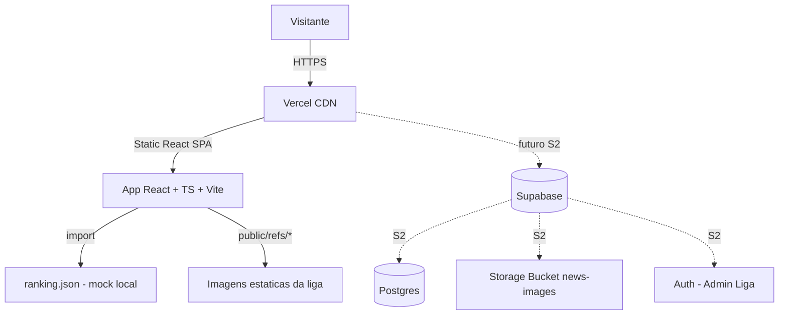
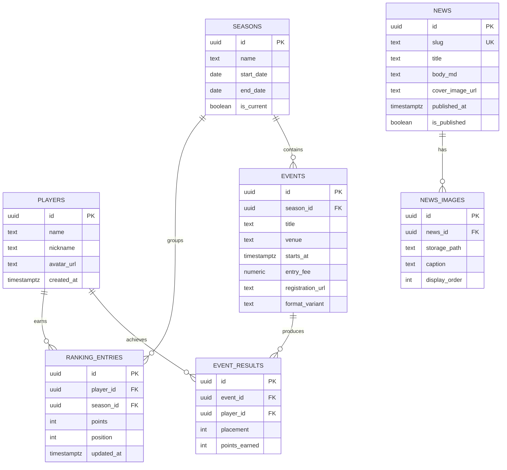

# Arquitetura — Sprint S1 · Premodern BH

## Diagrama (S1 — mockup JSON)



## Diagrama ER (preparado para S2 — Supabase)



## Decisoes de Stack

| Camada | Tecnologia | Justificativa |
|---|---|---|
| Build/Bundler | **Vite** | HMR instantaneo, zero-config pra React+TS |
| Framework | **React 18 + TypeScript** | Stack padrao do Guizao; tipagem no ranking |
| Roteamento | **React Router v6** | SPA com `/` e `/ranking` (`/noticias`, `/calendario` em S2) |
| Estilizacao | **Tailwind CSS v3** | Utility-first, tema customizado com paleta Premodern |
| Fonte | **Cinzel + EB Garamond** (Google Fonts) | Replica tipografia old frame |
| Data layer (S1) | **JSON estatico** + hook `useRanking()` | Zero dependencia externa; trocavel por fetch |
| BaaS (S2) | **Supabase** | Postgres + Auth + Storage + CDN em um so painel |
| Deploy | **Vercel** | Git push = deploy; preview por PR; free tier generoso |
| DNS/Dominio | a definir | `.com` ou `.com.br`; pode comecar com dominio Vercel |

## Estrutura de Pastas

```
site-premodern-bh/
├── docs/
│   └── arquitetura-S1.md               (este arquivo)
├── public/
│   ├── refs/                            (copiadas de refs/)
│   │   ├── logo.jpg
│   │   ├── gallery-*.png
│   │   └── ...
│   └── favicon.ico
├── src/
│   ├── assets/
│   │   └── ornaments/                   (SVGs de selo dourado, bordas)
│   ├── components/
│   │   ├── layout/
│   │   │   ├── Header.tsx
│   │   │   ├── Footer.tsx
│   │   │   └── Layout.tsx
│   │   ├── ui/
│   │   │   ├── CardFrame.tsx            (wrapper "old frame")
│   │   │   ├── PowerToughnessBox.tsx    (box de pontos do ranking)
│   │   │   ├── GoldSeal.tsx             (selo Top 8)
│   │   │   ├── Section.tsx
│   │   │   └── Button.tsx
│   │   ├── landing/
│   │   │   ├── Hero.tsx
│   │   │   ├── AboutPremodern.tsx
│   │   │   ├── AboutLeague.tsx
│   │   │   ├── HowToJoin.tsx
│   │   │   ├── Gallery.tsx
│   │   │   └── NextEvents.tsx
│   │   └── ranking/
│   │       ├── RankingTable.tsx
│   │       ├── RankingRow.tsx
│   │       └── Top8Banner.tsx
│   ├── data/
│   │   └── ranking.json                 (mockup S1)
│   ├── hooks/
│   │   └── useRanking.ts
│   ├── pages/
│   │   ├── HomePage.tsx
│   │   └── RankingPage.tsx
│   ├── types/
│   │   └── domain.ts                    (Player, RankingEntry, Event...)
│   ├── styles/
│   │   └── index.css                    (tailwind + vars + efeitos old frame)
│   ├── App.tsx
│   └── main.tsx
├── .env.example                         (SUPABASE_URL e SUPABASE_ANON_KEY — S2)
├── .gitignore
├── index.html
├── package.json
├── postcss.config.js
├── tailwind.config.js
├── tsconfig.json
├── vercel.json                          (rewrites para SPA)
└── vite.config.ts
```

## Tema Tailwind (tailwind.config.js)

```js
theme: {
  extend: {
    colors: {
      'pm-bg':         '#1A1613',
      'pm-green':      '#5C7A3E',
      'pm-green-deep': '#3A4F26',
      'pm-parchment':  '#E8DCC0',
      'pm-parchment-2':'#D4C59E',
      'pm-brown':      '#8B6F47',
      'pm-frame':      '#3D2F1F',
      'pm-gold':       '#C9A961',
      'pm-gold-hi':    '#E8C472',
      'pm-ink':        '#1F1A14',
      'pm-cream':      '#F5EFD8',
    },
    fontFamily: {
      title: ['Cinzel', 'serif'],
      body:  ['"EB Garamond"', 'Georgia', 'serif'],
    },
    boxShadow: {
      'old-frame': 'inset 0 0 0 2px #3D2F1F, inset 0 0 0 4px #8B6F47, inset 0 0 0 6px #E8DCC0',
      'card-lift': '0 4px 18px rgba(0,0,0,0.45)',
    }
  }
}
```

## Schema Supabase (preparado para S2)

```sql
-- players
create table players (
  id uuid primary key default gen_random_uuid(),
  name text not null,
  nickname text,
  avatar_url text,
  created_at timestamptz default now()
);

create table seasons (
  id uuid primary key default gen_random_uuid(),
  name text not null,
  start_date date,
  end_date date,
  is_current boolean default false
);

create table ranking_entries (
  id uuid primary key default gen_random_uuid(),
  player_id uuid references players(id) on delete cascade,
  season_id uuid references seasons(id) on delete cascade,
  points int not null default 0,
  position int,
  updated_at timestamptz default now(),
  unique (player_id, season_id)
);

create table events (
  id uuid primary key default gen_random_uuid(),
  season_id uuid references seasons(id) on delete set null,
  title text not null,
  venue text,
  starts_at timestamptz not null,
  entry_fee numeric(10,2),
  registration_url text,
  format_variant text
);

create table event_results (
  id uuid primary key default gen_random_uuid(),
  event_id uuid references events(id) on delete cascade,
  player_id uuid references players(id) on delete cascade,
  placement int,
  points_earned int default 0
);

create table news (
  id uuid primary key default gen_random_uuid(),
  slug text unique not null,
  title text not null,
  body_md text,
  cover_image_url text,
  published_at timestamptz,
  is_published boolean default false
);

create table news_images (
  id uuid primary key default gen_random_uuid(),
  news_id uuid references news(id) on delete cascade,
  storage_path text not null,
  caption text,
  display_order int default 0
);

-- RLS: leitura publica, escrita apenas autenticado (admin)
alter table players enable row level security;
alter table ranking_entries enable row level security;
alter table events enable row level security;
alter table news enable row level security;

create policy "public read players" on players for select using (true);
create policy "public read ranking" on ranking_entries for select using (true);
create policy "public read events" on events for select using (true);
create policy "public read news" on news for select using (is_published);

-- Storage bucket: news-images (publico, leitura livre)
```

## Padroes de Codigo

- **Componentes pequenos**, um por arquivo, default export
- **Types em `src/types/domain.ts`** — single source of truth
- **Hooks isolam data access** — `useRanking()` troca de JSON -> Supabase sem tocar UI
- **Tailwind inline**, utilities > CSS custom — so cair pra CSS quando efeito old-frame exigir
- **Sem estado global** nesta sprint — props + Context pontual se precisar

## Seguranca (S2 - quando Supabase entrar)

- RLS ligado em todas as tabelas
- Anon key no client so le; write exige auth
- Storage bucket com policy "read public, write authenticated"
- Sem secrets no repo; `.env.local` no gitignore; `.env.example` publico

## Arquivos a CRIAR na S1

- Raiz: `package.json`, `vite.config.ts`, `tsconfig.json`, `tailwind.config.js`, `postcss.config.js`, `index.html`, `.gitignore`, `.env.example`, `vercel.json`
- `src/`: `main.tsx`, `App.tsx`, `styles/index.css`
- Todos os componentes listados na arvore acima
- `src/data/ranking.json` (Guizao-Back)
- `public/refs/` populado a partir de `refs/`

## Arquivos a MODIFICAR

- Nenhum — projeto inicia vazio.

## Proximos passos da esteira

1. **[Guizao-Front]** cria cards no dashboard e implementa scaffold + landing + ranking
2. **[Guizao-Back]** cria `ranking.json` com os 24 jogadores reais
3. **[Guizao-Test]** elabora plano de testes manuais
4. **[Guizao-Git]** orienta commits e branch
5. **[Guizao-DevOps]** configura deploy Vercel
6. **[Guizao-Document]** fecha a Sprint em `.md`
